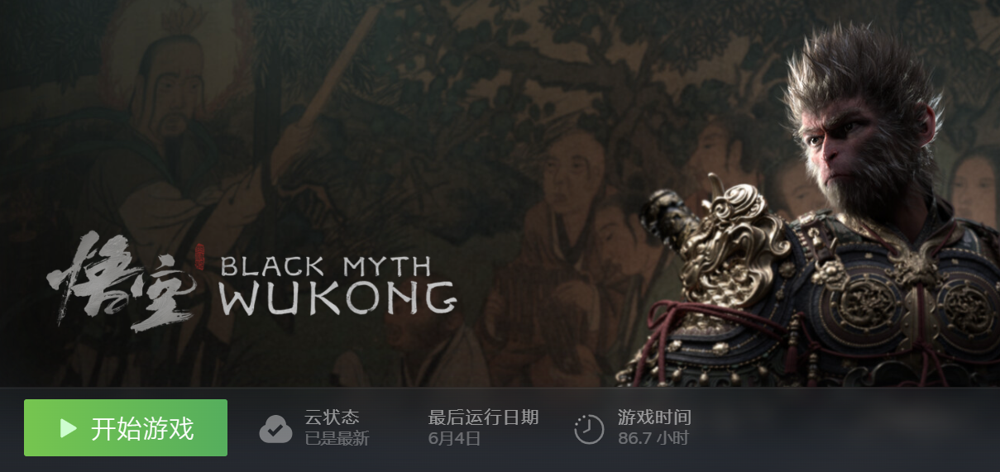

# WuKongGAS

## 写在开头

本部分内容探索黑神话的技能系统，学习动作游戏的技能系统实现，最终希望基于UE的GAS实现一个拥有时间轴的可视的技能编辑器。具体内容分为对黑神话技能的列举分析以及具体的实现方法。

## 部分游戏体验记录

# 目录

## 分析部分
[黑神话悟空技能分析](记录文件/Notes/分析/黑神话悟空技能分析.md)

[技能编辑器构想](记录文件/Notes/分析/技能编辑器构想.md)

## 实现部分
[GAS学习](记录文件/Notes/实现/GAS学习.md)

[基础近战技能完整实现流程](记录文件/Notes/实现/基础近战技能完整实现流程.md)

[多段攻击技能实现](记录文件/Notes/实现/多段攻击技能实现.md)

[锁定及锁定条件下的技能释放](记录文件/Notes/实现/锁定及锁定条件下的技能释放.md)

[摄像机行为](记录文件/Notes/实现/摄像机行为.md)
