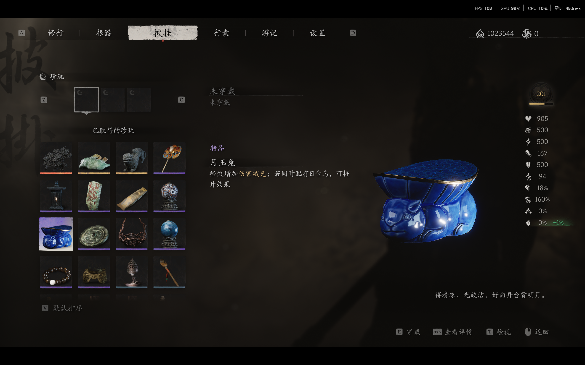
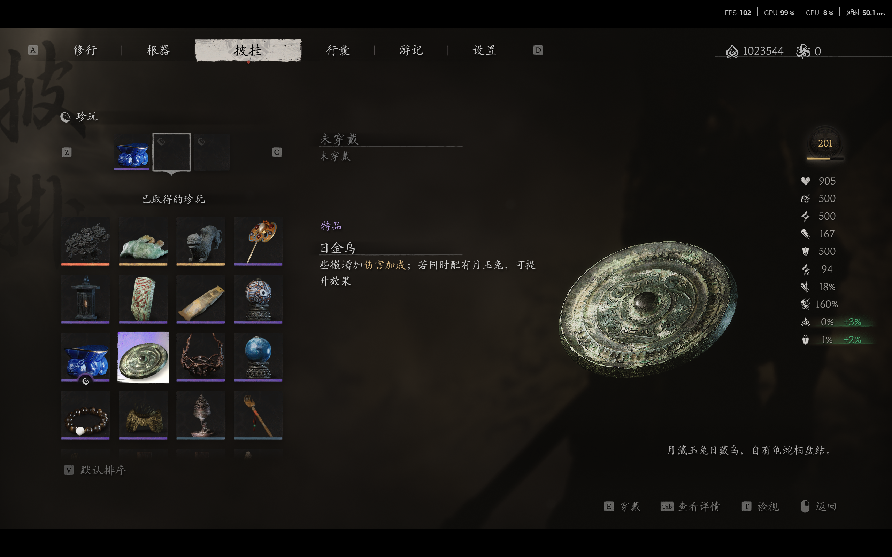
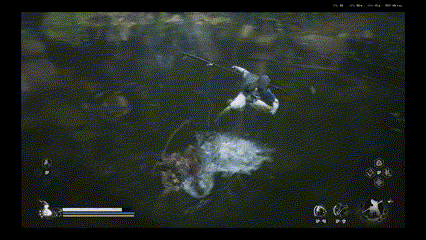
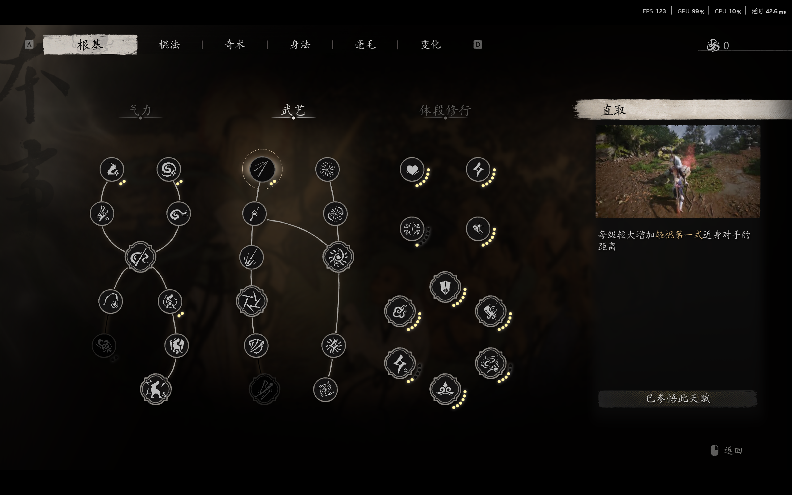
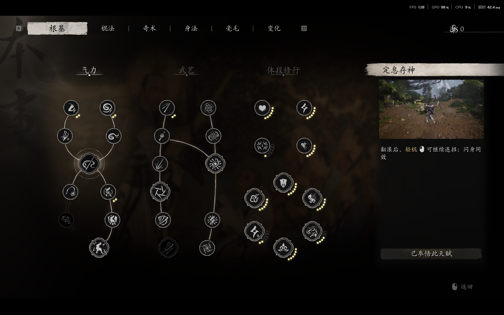
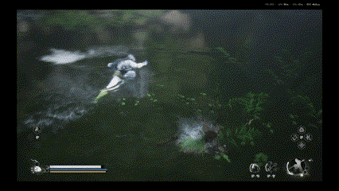
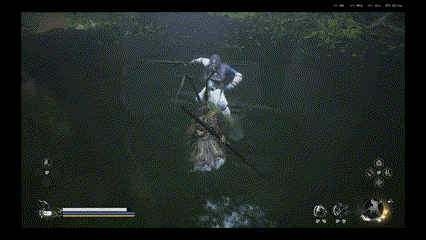
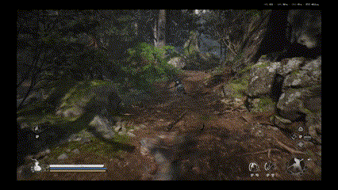

# 黑神话·悟空技能系统探索

## 属性表

## 装备系统
RPG必备的装备和背包系统，这里不讨论游戏中背包的实现，只关注装备对属性的改变和其他影响。除了基础的装备修改对应属性外，装备之间还可能出现套装效果，如黑神话中的 月玉兔 和 日金乌 （注意这里单件装备和混合装备提供的属性不同）

以及更为普遍的披挂套装效果(装备多件提供额外加成)

还有其他有特殊效果的装备，比如 三尖两刃抢 会修改主角的整个攻击动作
（补充图片）

## 基础技能
这里列举动作游戏的常见技能

### 普通攻击
动作游戏中的普通攻击往往不是连续的相同动作（2D恶魔城游戏中常见）
如黑猴的普通攻击为四段

此外，黑猴的第一段普攻会拉近自己与敌人的距离，有利于玩家在开始进攻回合后集中注意力进攻，现代的动作游戏使用这一特性降低了上手难度。

### 动作衔接
动作游戏中玩家在进攻的同时需要插入闪避，格挡等动作，通过在这些动作后恢复原本的进攻行为有利于保证动作的连贯和进攻的节奏（或者像魂系列一样在躲避（翻滚）后进行另外的特殊动作）

一些特殊技能也需要在其他技能释放阶段才能使用

### 闪避
动作游戏中玩家在即将受到攻击时使用闪避可以躲开敌人攻击。同时，动作游戏往往鼓励玩家进行极限闪避，极限闪避能够触发一系列对玩家有利的效果

### 格挡反击
行为与闪避类似，但是表现不同，格挡反击的风险和收益比闪避更高，与一般动作游戏中格挡作为一个单独动作不同，黑猴的格挡反击附加在进攻行为中

### 锁定
动作游戏中常通过锁定操作来控制摄像机和角色行为，目的是让屏幕集中在玩家关注的敌人上，以方便玩家获取相应信息。

如gif所示，黑神话中摄像机的行为包括：
* 摄像机会在角色移动后经过一定延迟再进行跟随
* 摄像机实际会比角色高一点，防止被角色遮挡关键信息
* 另外，锁定下的移动行为表现为：
    * 普通移动时朝向敌人
    * 加速移动时和非锁定时一样
