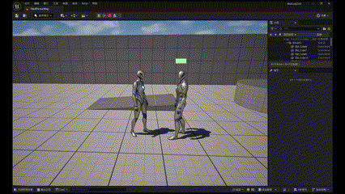
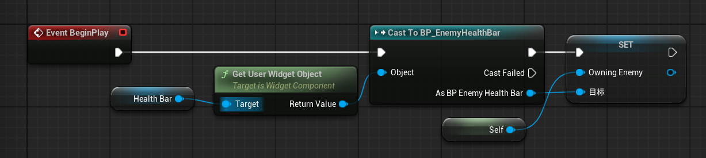
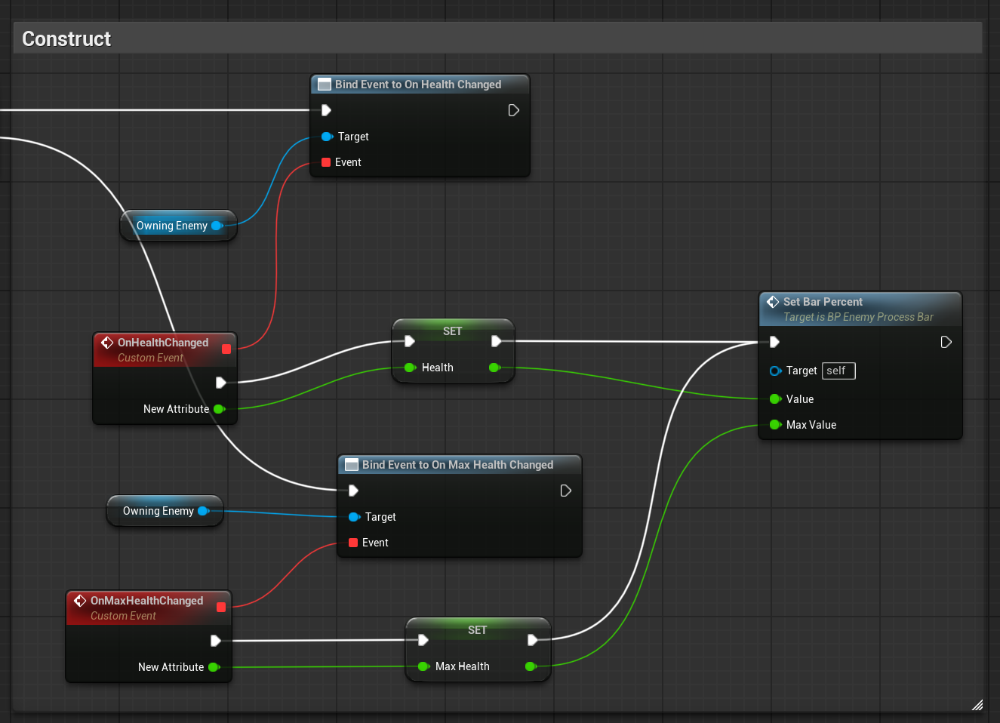
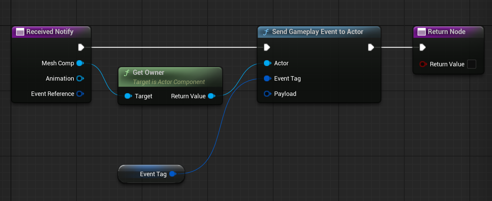
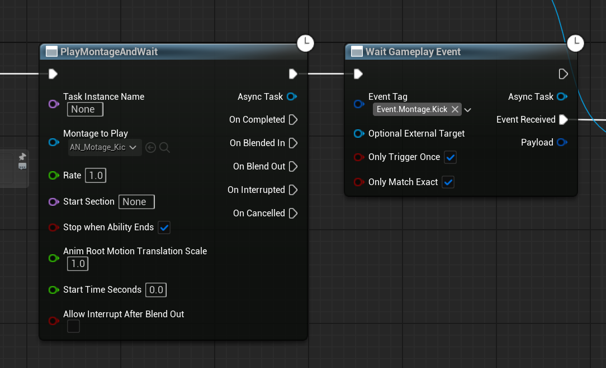

# 基础近战技能完整实现流程

从最基本的攻击，扣除目标血量，UI上显示结果开始

实现结果：



这部分需要完成：
* GAS插件配置
* ASC设置和绑定
* AttributeSet设置和绑定
* 在UI上绑定Attribute
* 攻击GA的编辑
* 伤害GE的编辑

### GAS插件配置
1. 在插件中搜索添加 Gameplay Abilities
2. 在项目Build.cs文件的PublicDependencyModuleNames里添加“GameplayAbilities”，“GameplayTags”，“GameplayTasks”。
3. 重启UE

### ASC
ASC是使用GAS的基础，使character可以使用GA，受GE影响。ASC可以放在Charactor或PlayerState上。ASC需要指定自己的Owner和Avatar，Owner是拥有ASC的Actor，Avatar是ASC实际作用的Actor

#### 在Character上添加ASC组件
创建了一个使用GAS的ACharacter基类，后续需要使用GAS的Character都从此派生
```C++
// .h文件

// 头文件
#include "AbilitySystemComponent.h"
#include "AbilitySystemInterface.h"

// 类中
public: 
    virtual UAbilitySystemComponent* GetAbilitySystemComponent()const override;

    UPROPERTY(VisibleAnywhere, BlueprintReadOnly, Category = "Abilities")
    class UAbilitySystemComponent* AbilitySystemComponent;

// .cpp文件

// 构造函数
AbilitySystemComponent = CreateDefaultSubobject<UAbilitySystemComponent>(TEXT("AbilitySystem"));

// ASC接口
UAbilitySystemComponent* AGASCharacterBase::GetAbilitySystemComponent() const
{
	return AbilitySystemComponent;
}
```
派生自AGASCharacterBase的类在蓝图编辑器中能够看到GAS组件

#### 在PlayerState上添加ASC组件
PlayerState用于保存联网游戏中玩家的状态，本实现不涉及联网操作，因此不使用PlayerState

### AttributeSet设置和绑定
创建一个Character属性集基类，里面只有所有属性集共有的属性

UE提供了以下宏来方便定义属性的接口
```C++
#define ATTRIBUTE_ACCESSORS(ClassName, PropertyName) \
	GAMEPLAYATTRIBUTE_PROPERTY_GETTER(ClassName, PropertyName) \	/* GetPropertyNameAttribute()	*/
	GAMEPLAYATTRIBUTE_VALUE_GETTER(PropertyName) \					/* GetPropertyName()			*/
	GAMEPLAYATTRIBUTE_VALUE_SETTER(PropertyName) \					/* SetPropertyName(float)		*/
	GAMEPLAYATTRIBUTE_VALUE_INITTER(PropertyName)					/* InitPropertyName(float)		*/

```
在属性集中定义生命值属性
```C++
public:

	UPROPERTY()
	FGameplayAttributeData Health = 100.0f;
	ATTRIBUTE_ACCESSORS(UCharacterAttributeSetBase, Health);

	UPROPERTY(EditAnywhere, BlueprintReadOnly)
	FGameplayAttributeData MaxHealth = 100.0f;
	ATTRIBUTE_ACCESSORS(UCharacterAttributeSetBase, MaxHealth)
```
在角色类中定义AS
```C++
UPROPERTY(EditAnywhere, BlueprintReadWrite, Category = "AttributeSet")
UCharacterAttributeSetBase* CharactorAttributeSet = nullptr;
```
然后发现在UE编辑器上无法选择属性集（选项表为空）

这是因为CharacterAttributeSet是一个指针，我们需要为它指定一个角色属性集派生类的实例，但在这个场景下我们希望在编辑器选择类。当然，也可以直接在C++代码中写死，直接创建目标类的实例，然后绑定到ASC，但是这样不灵活，而且我尝试了很久都不对。

于是使用TSubClassOf
```C++
UPROPERTY(EditAnywhere, BlueprintReadWrite, Category = "AttributeSets")
TArray<TSubclassOf<class UAttributeSet>> AttributeSets;
```
注意同一个角色可以拥有多个属性集，这样更加灵活。TSubClassOf是UE专门用于类选择的类型，自动集成了反射系统。如果想要在编辑器中选择类，就可以使用TSubClassOf。接下来需要将选择的属性集类绑定到ASC
```C++
for (TSubclassOf<UAttributeSet>& Set : AttributeSets)
{
    AbilitySystemComponent->InitStats(Set, AttrDataTable);
}
```
只需要一个属性表可以绑定所有的属性集，GAS需要的属性表项为：Name BaseValue MinValue MaxValue DerivedAttributeInfo bCanStack。丝毫不差地写在csv文件第一行，注意Name项格式为 属性集类.属性名 。InitStats中使用属性的Name匹配DataTable中的Name，如果匹配上了就写入表中数据，因此只需一个包含所有属性的表即可。具体逻辑为
```C++
// AttrSetName.PropertyName
FString RowNameStr = FString::Printf(TEXT("%s.%s"), *Property->GetOwnerVariant().GetName(), *Property->GetName());

FAttributeMetaData * MetaData = DataTable->FindRow<FAttributeMetaData>(FName(*RowNameStr), Context, false);
```

### 在UI上绑定Attribute
#### 敌人基类
敌人基类有一个血条控件，以及两个控制血条变化的属性变化响应委托，通过委托在血量属性变化时广播，从而实现UI响应变化。GAS的属性委托写法如下
```C++
AbilitySystemComponent->GetGameplayAttributeValueChangeDelegate(AttributeSet->GetHealthAttribute()).AddLambda(
	[this](const FOnAttributeChangeData& Data)
	{
		OnHealthChanged.Broadcast(Data.NewValue);
	}
);
```
这里的AttributeSet是一个属性集实例，可以从ASC获得
```C++
const UMyAttributeSet* AttributeSet = Cast<UMyAttributeSet>(AbilitySystemComponent->GetAttributeSet(UMyAttributeSet::StaticClass()));
```

#### 血条控件
接下来将血条变化绑定到敌人实例的委托，首先是为了获取属性委托，血条控件需要获取敌人实例。直接在敌人类的beginplay完成

接下来在血条控件的蓝图中绑定血条变化函数，即在属性变化响应时修改控件中的血量变量，然后设置进度条的百分比

最后，虽然属性集里的属性自动初始化了，但是控件没有初始化，需要在角色类进行一次广播，并且控件委托绑定会比角色类的BeginPlay晚一点，我这里暂时不知道其他解决方法，直接采用了延时广播。
```C++
FTimerHandle TimerHandle;
GetWorld()->GetTimerManager().SetTimer(TimerHandle, [this, AttributeSet]()
{
	OnHealthChanged.Broadcast(AttributeSet->GetHealth());
	OnMaxHealthChanged.Broadcast(AttributeSet->GetMaxHealth());
}, 0.1f, false);
```
到此实现了UI跟随属性变化

### 攻击GA的编辑
同样，为了在编辑器选择角色类可以使用的技能，使用TSubClassOf声明技能类，并在beginplay初始化
```C++
// .h
UPROPERTY(EditAnywhere, BlueprintReadWrite, Category = "Abilities")
TArray<TSubclassOf<class UGameplayAbility>> Abilities;

// .cpp
// 绑定所有技能
for (auto i = 0; i < Abilities.Num(); i++)
{
    if (Abilities[i] == nullptr) { continue; }
    AbilitySystemComponent->GiveAbility(FGameplayAbilitySpec(Abilities[i].GetDefaultObject(), 1, 0));
}
// 设置技能的拥有者和作用者
AbilitySystemComponent->InitAbilityActorInfo(this, this);
```
攻击GA的流程为 

播放蒙太奇->在期望造成伤害的点触发通知->检测攻击范围内的所有目标->应用GE

在蒙太奇界面的Notify（通知）栏的适当时间点添加通知，这里重载了动画通知，在接收通知时发送一个事件，随后在GA中得到事件时进行后续攻击逻辑

采用GA中专门的函数来播放动画

之后需要检测攻击范围内的目标，这里索引到动作（踢）的进攻点（右脚）的骨骼，检测攻击范围内的所有Actor，将实现了战斗接口的Actor存入数组，随后遍历数组，应用GE。范围检测仿照GameplayStatics文件中的ApplyRadialDamageWithFalloff函数，即创建一个球，检测球内除登记忽略的Actor。
```C++
void UWKGASBlueprintFunctionLibrary::GetLivePlayersWithinRadius(const UObject* WorldContextObject, TArray<AActor*>& OutOverlappingActors, const TArray<AActor*>& ActorsToIgnore, float Radius, const FVector& SphereOrigin)
{
	FCollisionQueryParams SphereParams;
	SphereParams.AddIgnoredActors(ActorsToIgnore); 

	TArray<FOverlapResult> Overlaps; 
	if (UWorld* World = GEngine->GetWorldFromContextObject(WorldContextObject, EGetWorldErrorMode::LogAndReturnNull)) //获取当前所处的场景，如果获取失败，将打印并返回Null
	{
		World->OverlapMultiByObjectType(Overlaps, SphereOrigin, FQuat::Identity, FCollisionObjectQueryParams(FCollisionObjectQueryParams::InitType::AllDynamicObjects), FCollisionShape::MakeSphere(Radius), SphereParams);
		for (FOverlapResult& Overlap : Overlaps) 
		{
			//判断当前Actor是否包含战斗接口   Overlap.GetActor() 从碰撞检测结果中获取到碰撞的Actor
			const bool ImplementsCombatInterface = Overlap.GetActor()->Implements<UCombatInterface>();
			//判断当前Actor是否存活
			if (ImplementsCombatInterface && !ICombatInterface::Execute_IsDead(Overlap.GetActor()))
			{
				OutOverlappingActors.AddUnique(Overlap.GetActor());
			}
		}
	}
}
```

### 伤害GE的编辑
这里的GE只是一个简单的扣除属性集中的血量

至此，一个基础的攻击技能的完成流程实现。以下记录一些经验

* GA，AS需要在ASC中登记，并进行相关初始化，二者都是基于ASC执行和修改的，GE则比较独立，只是应用到ASC上产生效果。
* 在编辑器选择的GA和AS本质是类，而不是实例，要获取实例，可以直接从ASC中获取
* 接口可以用来判定需要作用的实例