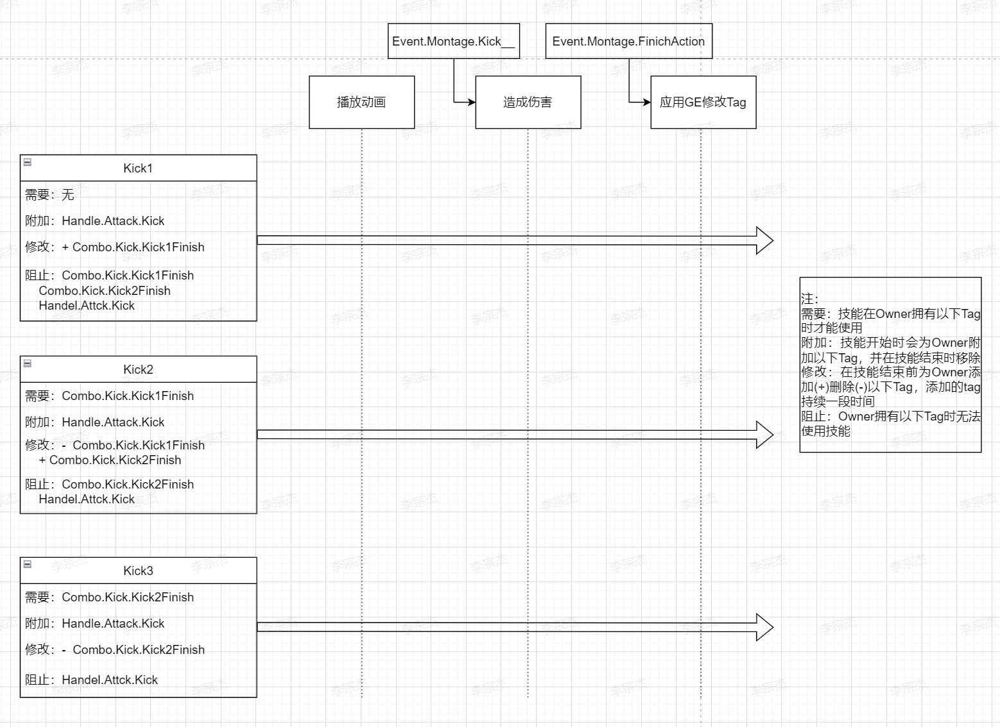
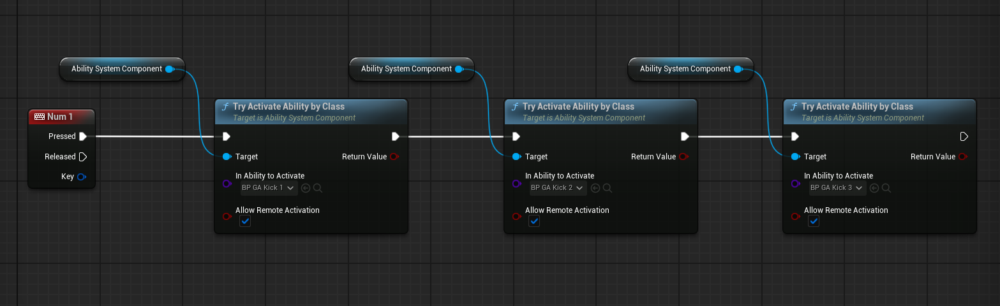

# 多段攻击技能实现

实现结果：

根据[基础技能实现流程](基础近战技能完整实现流程.md)，增加了两个普通攻击技能，Kick2、Kick3。接下来希望Kick、Kick2、Kick3之间衔接，具体来说：
* 开始按攻击键使用Kick，此时不满足Kick2和Kick3的条件
* Kick 后一定时间内增加使用Kick2的条件，此时禁止Kick 和Kick3
* Kick2后一定时间内增加使用Kick3的条件，此时禁止Kick 和Kick2
* 每个技能进行时禁止其他任何技能

整个过程的流程图总结如下：

使用GameplayTag来控制这个流程，具体的Tag对应作用如下：
* Handle.Attack.Kick：表示当前正在进行踢击动作，在动作开始时附加，结束时移除，由此阻止在动作进行时使用技能。
* Combo.Kick.Kick_Finish：表示当前动作完成，作为下一个动作的条件，控制Combo流程的进行。
* Event.Montage.Kick__：触发伤害事件
* Event.Montage.FinishAction：技能结束事件
* 图中的Tag操作对应到UE编辑器为：
    * 需要：GA类默认值中的“激活所需标签”
    * 附加：GA类默认值中的“激活已拥有标签”（神奇翻译）
    * 修改：用GE修改
    * 阻止：GA类默认值中的“激活阻止标签”

注意到在通知中添加了一个FinishAction事件，这是因为动作动画往往有一定后摇，而游戏里的Combo往往允许玩家在前一动作还没完全结束时衔接下一个动作，使用这个事件可以灵活的控制允许下个动作衔接的时间。具体来说，我在这个事件后使用ApplyGameplayEffect添加下一动作的条件Tag并调用EndAbility。

我使用GE来添加下一动作条件的Tag，这是因为GA的类默认值中的附加Tag代表在动作开始添加Tag，动作结束时移除。而我需要在动作结束时添加下一动作的条件Tag并保持一定时间。

最后提一下Character里调用技能的蓝图

因为我严格确定了每个技能的调用条件，保证任何时刻只有一个技能满足条件，另外两个不满足条件或被阻止，所以这里顺序其实没有影响。但如果多个技能都满足条件，那么会调用最后那个（因为是异步调用，而不是顺序）

最后别忘了在角色类默认值中添加技能

## 总结及后续
通过使用GAS完整实现了近战技能的流程，梳理了GAS系统配置，技能GA编辑，技能效果GE的使用方法。基本熟悉了GAS的基本操作。

我实现的近战攻击在选定受击目标时采用一个位于角色脚部（攻击部分）的球体在接收到蒙太奇通知时进行检测，这样导致了整个攻击过程只有一部分进行伤害判定。目前有两种修改方案：
1. 扩大通知时的检测范围，可以采用一个长方体进行受击目标检测，但这样会有敌人在动画上还未受击就扣除血量的效果，如果攻击动画较快可以忽略此缺点
2. 在一个连续的时间进行检测，这样会导致更大的开销，性能上不是很好。
准备了解以下现代动作游戏对近战攻击判定的处理后在决定

此外，目前通过一个固定的GE来扣除受击目标的血量，后续应该将技能的作用属性绑定到技能本身上，GE仅仅执行属性的修改。