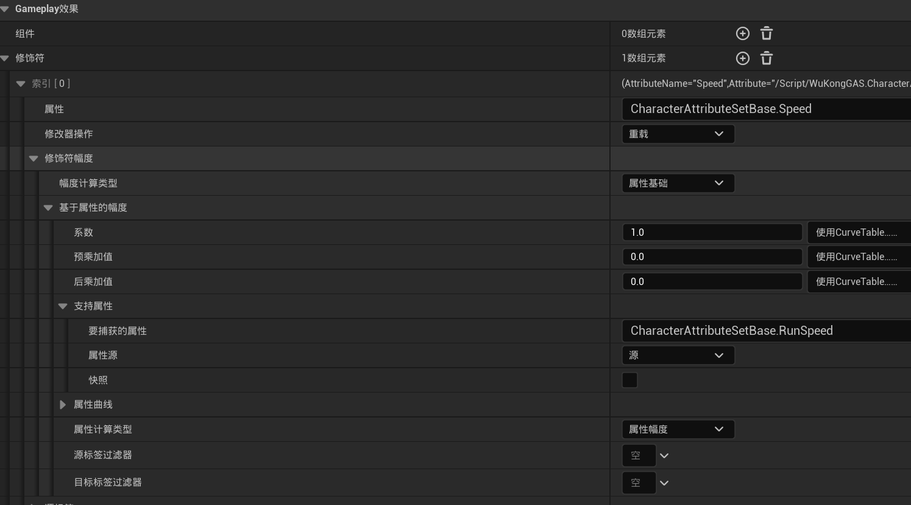
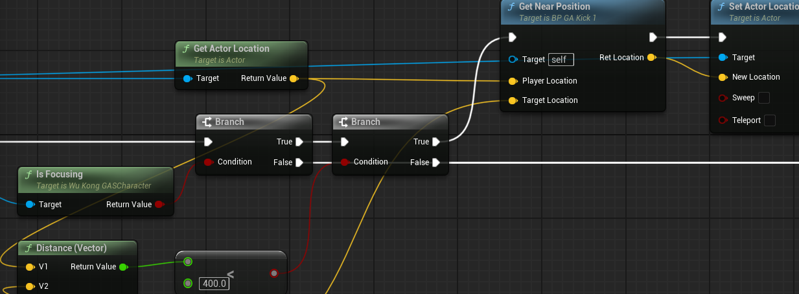
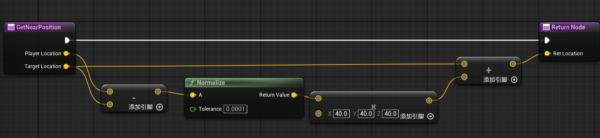

# 摄像机行为

在实现了锁定操作后，我发现原有的摄像机行为难以适配，具体表现为锁定时角色自身会遮挡锁定的敌人，难以获取游戏过程中需要的信息。于是，我重新分析了黑神话里面的摄像机行为


可以看到，和之前设想的一样，锁定过程中敌人（几乎）保持处于屏幕中心，但玩家操控的角色并没有。具体来说，在黑神话中：
* 摄像机会在角色移动后经过一定延迟再进行跟随
* 摄像机实际会比角色高一点，防止被角色遮挡关键信息
* 另外，锁定下的移动行为表现为：
    * 普通移动时朝向敌人
    * 加速移动时和非锁定时一样

由此，对原有的摄像机行为进行优化修改

## 修改后演示

## 调整摄像机行为

### 摄像机延时跟随

通过CameraBoom组件可以方便的调节摄像机和角色的相对位置，默认情况下摄像机位于角色的正后方，在动作游戏中摄像机位置相对会高一点，在这里设置位置为（0，0，80）

UE中可以简单的实现摄像机延迟跟随，只需要修改CameraBoom组件的一些属性
```C++
// 开启延时跟随
CameraBoom->bEnableCameraLag = true;
// 跟随的速度
CameraBoom->CameraLagSpeed = 5.0f; 
// 最大落后距离
CameraBoom->CameraLagMaxDistance = 1000.0f;
// 最大落后时间
CameraBoom->CameraLagMaxTimeStep
```

### 修改寻找目标逻辑

原本的的寻找目标逻辑为由摄像机为起点寻找摄像机前的目标Actor，但摄像机和角色是有一定距离的，这就导致角色之后，摄像机之前区域内的Actor可能会被错误选中。因此实际的选择扫描起点应该从角色开始，但锁定目标是根据摄像机指向选定的，于是有扫描起点应该在摄像机指向方向上。最终修改如下：
```C++
FVector Start = CameraManager->GetCameraLocation() + CameraManager->GetCameraRotation().Vector() * CameraOffset;
FVector End = Start + CameraManager->GetCameraRotation().Vector() * MaxDistance;
```
我添加了新的参数CameraOffset，传递CameraBoom组件的目标臂长度

## 锁定下的角色行为
### 疾跑
首先补充实现疾跑功能，具体来说：
* 按下左Shift加速
* 松开左Shift恢复原本速度

速度可以通过修改CharacterMovement中的MaxWalkSpeed改变（使用键盘时按下移动键就是最大速度），如锁定时角色行为会根据速度变化一样，速度属性会影响动作游戏的其他部分，因此我在属性集AS中加入速度属性。
```C++
UPROPERTY(EditAnywhere, BlueprintReadOnly)
FGameplayAttributeData WalkSpeed = 300.0f;
ATTRIBUTE_ACCESSORS(UCharacterAttributeSetBase, WalkSpeed)

UPROPERTY(EditAnywhere, BlueprintReadOnly)
FGameplayAttributeData RunSpeed = 500.0f;
ATTRIBUTE_ACCESSORS(UCharacterAttributeSetBase, RunSpeed)

UPROPERTY(EditAnywhere, BlueprintReadOnly)
FGameplayAttributeData Speed = 300.0f;
ATTRIBUTE_ACCESSORS(UCharacterAttributeSetBase, Speed)
```
同时在角色类中添加属性变化回调
```C++
AbilitySystemComponent->GetGameplayAttributeValueChangeDelegate(AttributeSet->GetSpeedAttribute()).AddLambda(
	[this, AttributeSet](const FOnAttributeChangeData& Data)
	{
		GetCharacterMovement()->MaxWalkSpeed = Data.NewValue;
	}
);
```
这样，便可以通过GA应用GE直接修改速度属性来改变玩家速度，在之前我应用GE修改生命值属性时是直接减去固定值，在这里我希望Speed值在WalkSpeed和RunSpeed之间切换，用GE也可以简单实现


选择幅度计算类型为“属性基础”，便可以选择捕获源或者目标的属性了

### 锁定下角色移动行为
* 普通移动时朝向敌人
* 加速移动时和非锁定时一样

在之前，我设定角色在锁定时面向目标，这里采用一样的方法，只是在锁定开始时只存储相关属性和忽略摄像机移动操作
```C++
// UTargetComponent::StoreRotationMode()
bUseControllerRotationYaw = MyCharacter->bUseControllerRotationYaw;
bOrientRotationToMovement = MyCharacter->GetCharacterMovement()->bOrientRotationToMovement;
bUseControllerDesiredRotation = MyCharacter->GetCharacterMovement()->bUseControllerDesiredRotation;

if (AController* Controller = MyCharacter->GetController())
{
	Controller->SetIgnoreLookInput(true);
}
```
具体的属性在速度属性变化回调中修改，在TargetComponent中定义角色朝向的锁定和解锁函数
```C++
void UTargetComponent::LockCharacterLootAt()
{
	if (ACharacter* MyCharacter = Cast<ACharacter>(GetOwner()))
	{
		MyCharacter->bUseControllerRotationYaw = true;
		MyCharacter->GetCharacterMovement()->bOrientRotationToMovement = false;
		MyCharacter->GetCharacterMovement()->bUseControllerDesiredRotation = true;
	}
}

void UTargetComponent::UnlockCharacterLookAt()
{
	if (ACharacter* MyCharacter = Cast<ACharacter>(GetOwner()))
	{
		MyCharacter->bUseControllerRotationYaw = false;
		MyCharacter->GetCharacterMovement()->bOrientRotationToMovement = true;
		MyCharacter->GetCharacterMovement()->bUseControllerDesiredRotation = true;
	}
}
```
解锁函数设置角色不使用控制器的Yaw旋转，而是根据移动选择朝向。最后在属性回调函数中调用这两个函数
```C++
AbilitySystemComponent->GetGameplayAttributeValueChangeDelegate(AttributeSet->GetSpeedAttribute()).AddLambda(
	[this, AttributeSet](const FOnAttributeChangeData& Data)
	{
		GetCharacterMovement()->MaxWalkSpeed = Data.NewValue;
		if (IsFocusing() &&  TargetComponent)
		{
			if (Data.NewValue == AttributeSet->GetWalkSpeed())
			{
				TargetComponent->LockCharacterLootAt();
			}
			else if (Data.NewValue == AttributeSet->GetRunSpeed())
			{
				TargetComponent->UnlockCharacterLookAt();
			}
			
		}
	}
);
```

### 锁定下的角色攻击行为
现代的很多动作游戏有在进攻时将角色移动到合适目标前的行为。比如黑神话中在锁定，且目标距离玩家较近时会拉近玩家，我也简单写了这样的逻辑。具体来说，在第一段普通攻击时，若锁定且目标距离较近则移动到合适的攻击点。


这里不用AND连接两个条件（IsFocusing和Distance < 400）是因为Distance的计算需要TargetActor，两个条件同时判断会在没有TargetActor时报错。（C++里如果第一个条件判定错误就不会进行后面的判定，好像蓝图里不是这样）最后通过GetNearPosition确定合适的进攻位置，并移动过去


这里的位置为目标指向玩家40个单位的位置

## 总结及后续
锁定操作主要联系两个参与者：玩家和锁定目标。玩家需要根据锁定变化自己的行为，在动作游戏中常见有移动，摄像机朝向，技能释放。锁定目标除了显示锁定标记UI，还可能涉及到AI上的处理，比如在多敌人战斗时，让被玩家锁定的目标优先攻击玩家。

在我的项目中，玩家的行为通过目标组件（TargetComponent）实现，锁定目标由锁定接口（TargetInterface）定义，并实现其行为。同时我希望玩家角色类能方便地绑定访问锁定目标，在玩家类中添加了绑定和查询的接口。后续的一些技能释放便可通过获取目标Actor来确认释放目标。

我把寻找目标->锁定目标这一过程用GA编写，最后看来有点画蛇添足，这一过程完全没有使用任何GAS的功能，后续应该修改为普通的按键响应。