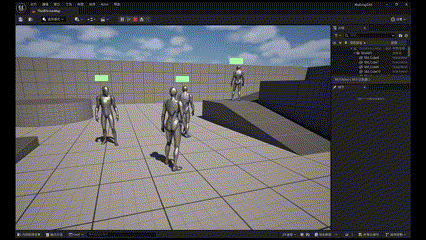
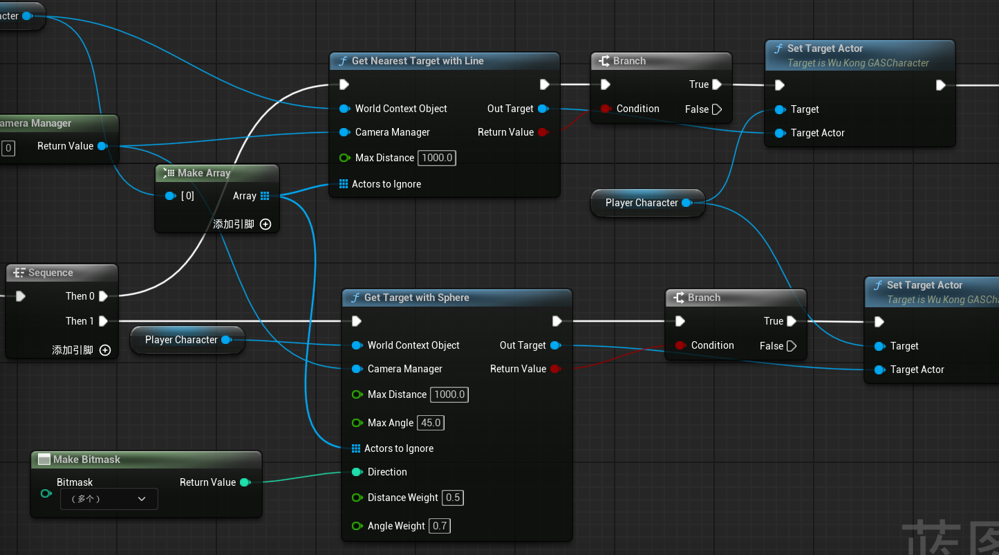
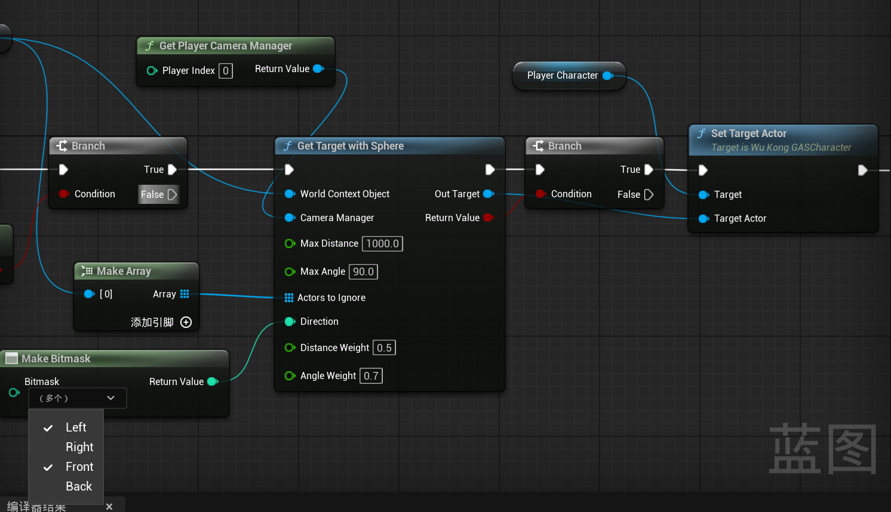
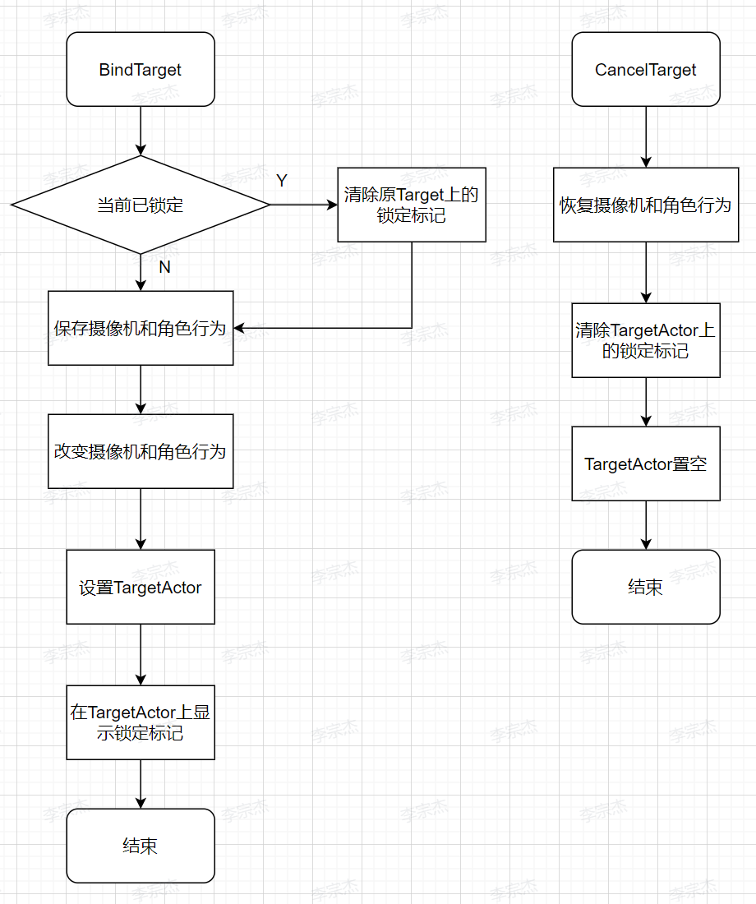

# 锁定及锁定条件下的技能释放

锁定是动作游戏中常见的技能，用于将摄像机锁定到目标敌人，方便玩家集中于当前目标。此外，锁定还是某些技能的释放条件，或影响技能释放。在有的游戏中，锁定还会影响敌人AI。本项目欲实现的锁定技能效果如下：
* 按键锁定，再次按下取消，可以通过其他按键切换锁定目标
* 锁定后在敌人身上显示UI（一个圈）
* 锁定后角色移动时面向敌人
* 锁定后技能释放自动朝向敌人

## 实现效果


## 选择锁定目标
本项目的选择策略为

1. 锁定只对一定范围内的敌人起作用
2. 首先判定摄像头射线触碰到的最近目标
3. 若没有触碰到目标则根据与敌人距离和角度加权判定

### 射线判定部分
主要使用LineTraceMultiByChannel函数，收集所有该方向上的Pawn（通过Channel指定），选择最符合条件的单位
```C++
bool const bHit = World ? World->LineTraceMultiByChannel(HitResults, Start, End, CollisionChannel, CollisionParams) : false;

// 获得所有和线段相交的符合条件的Actor
bool LineTraceMultiByChannel  
(  
    // 结果
    TArray < struct FHitResult > & OutHits,  
    // 线段起点终点
    const FVector & Start,  
    const FVector & End,
    // 碰撞通道，可以在项目设置中自定义，这里使用默认的ECC_PAWN
    ECollisionChannel TraceChannel,  
    // 其他参数，这里添加了忽略数组
    const FCollisionQueryParams & Params,  
    const FCollisionResponseParams & ResponseParam  
) const 
```
其中Start，End为摄像机起点和沿着摄像机方向到最大锁定距离的点
```C++
FVector Start = CameraManager->GetCameraLocation();
FVector End = Start + CameraManager->GetCameraRotation().Vector() * MaxDistance;
```
使用接口来判定是否能够锁定
```C++
const bool ImplementsTargetInterface = OverlappingActor->Implements<UTargetInterface>();
const bool NotImplementsCombatInterfaceOrNotDead = (OverlappingActor->Implements<UCombatInterface>()) ? (!ICombatInterface::Execute_IsDead(OverlappingActor)) : true;

if (ImplementsTargetInterface && NotImplementsCombatInterfaceOrNotDead)
```
 完整函数见 UWKGASBlueprintFunctionLibrary::GetNearestTargetWithLine

### 区域判定部分
使用SphereOverlapActors函数，收集以摄像机为中心，最大锁定距离为半径的球内所有Pawn，选择最符合条件的单位
```C++
UKismetSystemLibrary::SphereOverlapActors(WorldContextObject, CameraLocation, MaxDistance, ObjectTypes, nullptr, ActorsToIgnore, OverlappingActors);

// 获得与指定球体相交的所有符合条件的Actor
static bool SphereOverlapActors  
(  
    // 用来定位当前UWorld
    const UObject * WorldContextObject,  
    // 球的坐标和半径
    const FVector SpherePos,  
    float SphereRadius,
    // 判定是否检测Actor的参数
    const TArray < TEnumAsByte < EObjectTypeQuery > > & ObjectTypes,  
    UClass * ActorClassFilter,  
    const TArray < AActor * > & ActorsToIgnore, 
    // 结果
    TArray < class AActor * > & OutActors  
)  
```
同上，使用接口判定Actor是否能够锁定，然后通过距离和角度来为一个范围内的Actor评分，选择最合适的进行锁定
```C++
// Distance
float Distance = FVector::Distance(CameraLocation, OverlappingActor->GetActorLocation());
float NormDistance = FMath::Clamp(Distance / MaxDistance, 0.1f, 1.0f);

// Angle
float Angle = FMath::RadiansToDegrees(FMath::Acos(FVector::DotProduct(CameraForward, ActorDirection)));
float NormAngle = FMath::Clamp(Angle / MaxAngle, 0.0f, 1.0f);

// ChooseTarget
float Score = 1.0f / ((NormDistance * DistanceWeight) + (NormAngle * AngleWeight));
```
此外，我希望在锁定的时候使用键盘上的“←”“→”进行锁定切换，因此在这里增加了方向过滤
```C++
// Dirction
float DotForward = FVector::DotProduct(CameraForward, ActorDirection);
bool bIsInFront = DotForward > 0;

float DotRight = FVector::DotProduct(CameraRight, ActorDirection);
bool bIsInRight = DotRight > 0;

if ((Direction & ETargetDirection::FRONT) == 0 && bIsInFront
	|| (Direction & ETargetDirection::BACK) == 0 && !bIsInFront
	|| (Direction & ETargetDirection::LEFT) == 0 && !bIsInRight
	|| (Direction & ETargetDirection::RIGHT) == 0 && bIsInRight)
{
	continue;
}
```
我在这里使用了GA，GA的内容为寻找锁定目标，然后调用BindTarget（见下节）来完成锁定操作。但是这里应该不需要使用GA，因为没有用到GE或者其他GAS相关的东西，直接写为角色类的函数应该就行。


这里的操作为首先判定摄像机方向上的目标，没有找到则进行范围查找，如果当前已有目标，则取消锁定。


使用左右键切换锁定的操作则直接进行范围查找，并且只对一侧进行查找

## 锁定操作
当玩家锁定某个敌人后，我希望实现以下效果
* 摄像机保持朝向敌人
* 锁定的敌人上出现一个锁定标志
* 锁定后角色固定朝向敌人，并减慢速度
* 锁定状态下按左右键切换锁定目标

### 锁定标志
这个比较简单，就是在敌人基类上增加了一个UWidgetComponent，作为TargetMark，在锁定的时候通过Interface SetVisibility为true就行。
```C++
void AGASEnemyBase::Select_Implementation()
{
	if (TargetMark)
	{
		TargetMark->SetVisibility(true);
	}
}

// 在绑定锁定Actor时调用
bool ImplementsTargetInterface = Target->Implements<UTargetInterface>();
if (ImplementsTargetInterface)
{
	ChangeRotationMode();
	TargetActor = Target;
	ITargetInterface::Execute_Select(Target);
}
```
注意，要想先这样调用接口的函数以及判定类是否实现了某接口，需要把接口和接口函数声明为Blueprintable，即使用UE的反射功能，以本接口为例，实现如下
```C++
// Interface 头文件
UINTERFACE(MinimalAPI, Blueprintable)
class UTargetInterface : public UInterface
{
	GENERATED_BODY()
};

class WUKONGGAS_API ITargetInterface
{
	GENERATED_BODY()

	// Add interface functions to this class. This is the class that will be inherited to implement this interface.
public:
	
	UFUNCTION(BlueprintNativeEvent, BlueprintCallable)
	void Select();

	UFUNCTION(BlueprintNativeEvent, BlueprintCallable)
	void CancelSelect();
};

// 对应类中接口实现
virtual void Select_Implementation() override;
virtual void CancelSelect_Implementation() override;

// 判定是否实现该接口
bool ImplementsTargetInterface = Target->Implements<UTargetInterface>();

// 用指针直接调用接口函数
ITargetInterface::Execute_Select(InstancePtr);
```

### 锁定时角色和摄像机行为
我新建了一个TargetComponent来管理锁定状态下角色和摄像机的行为，完整的锁定和取消锁定流程如下


在改变摄像机和角色行为过程中，修改了三个参数
```C++
MyCharacter->bUseControllerRotationYaw = true;
MyCharacter->GetCharacterMovement()->bOrientRotationToMovement = false;
MyCharacter->GetCharacterMovement()->bUseControllerDesiredRotation = true;
```
* bUseControllerRotationYaw 控制角色是否同步控制器的Yaw（水平）旋转
* bOrientRotationToMovement 控制角色是否朝移动方向旋转
* bUseControllerDesiredRotation 控制角色是否使用控制器期望的旋转
同时忽略掉摄像机输入和进行减速
```C++
if (AController* Controller = MyCharacter->GetController())
{
	Controller->SetIgnoreLookInput(true);
}
MyCharacter->GetCharacterMovement()->MaxWalkSpeed = FocusingMaxSpeed;
```

随后，在TickComponent中每帧根据角色和目标的位置修改角色控制器旋转数据，上面的设置使得控制器的旋转直接同步到角色上
```C++
FVector TargetOffset = FVector(0.0f, 0.0f, 0.0f);
if (UCapsuleComponent* Capsule = MyCharacter->GetCapsuleComponent())
{
	TargetOffset.Z -= Capsule->GetScaledCapsuleHalfHeight();
}
FRotator TargetRotation = UKismetMathLibrary::FindLookAtRotation(MyCharacter->GetActorLocation(), TargetActor->GetActorLocation() + TargetOffset);
TargetRotation.Roll = 0.0f;

FRotator NewRotation = UKismetMathLibrary::RInterpTo_Constant(MyCharacter->GetControlRotation(), TargetRotation, GetWorld()->GetDeltaSeconds(), 200.0f);

MyCharacter->GetController()->SetControlRotation(NewRotation);
```
